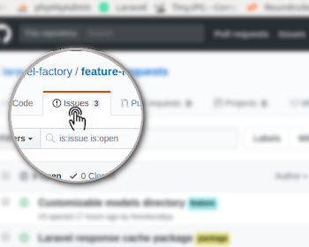
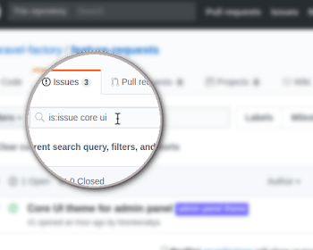
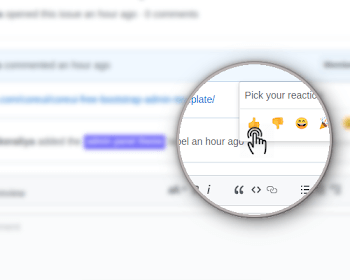
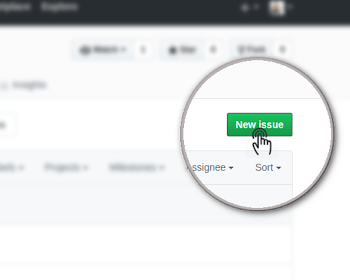

## Request a feature (or report a bug) for [Laravel Factory](https://laravelfactory.com)

> This repository is used to track feature requests and bug reports of Laravel Factory. We use Issues feature of Github which is quite powerful and there is no need for a dedicated feature request tracking system. Here are the quick steps to follow:

|||
|--|--|
| |**Step:1 Click on the issues tab at the top.**|
|**Step:2 Search in the Filters to check if similar request is already submitted**| |
||**Step:3 If there is already a similar request, you may vote for it and comment for any additional info.**|
|**Step:4 If not, you may go ahead and create a new issue for your request**||

> We would label your request accordingly and keep you updated.
